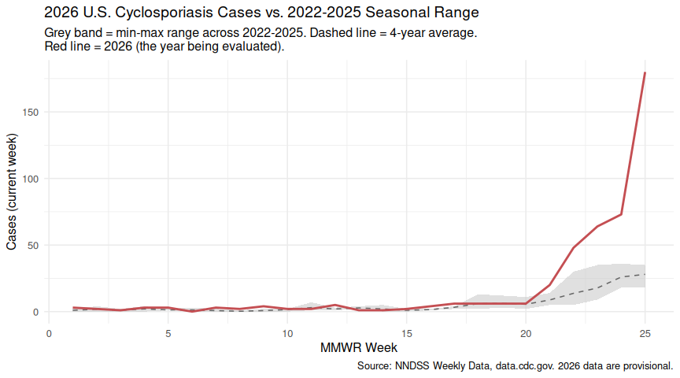
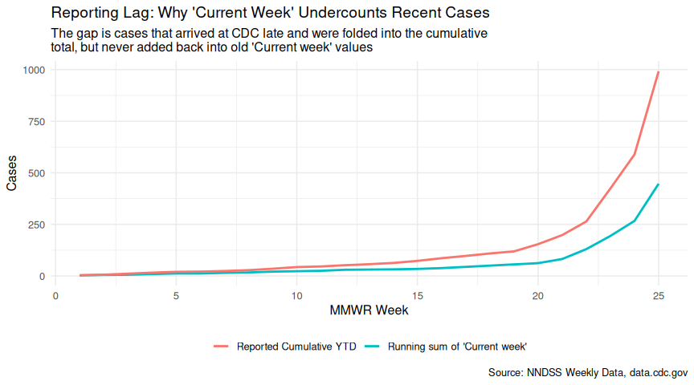
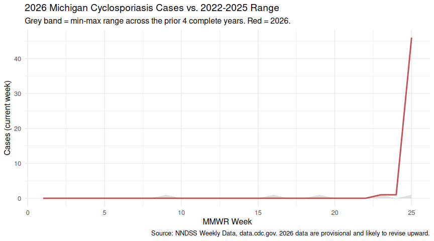
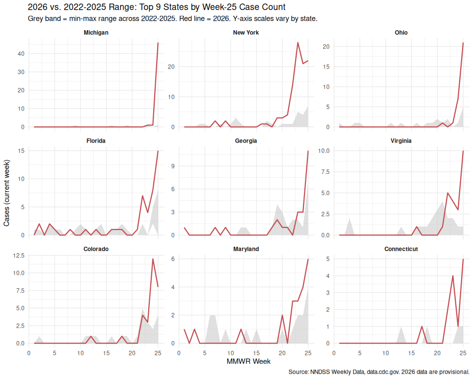

2026 U.S. Cyclosporiasis Outbreak: A Seasonal Baseline Analysis
================
Elizabeth Meehan, MPH
2026-07-04

## Overview

This is a beginner epidemiology project using R to explore the 2026 U.S.
cyclosporiasis (*Cyclospora*) outbreak, with a focus on Michigan’s
late-June cluster. It’s a learning exercise, not an official public
health analysis.

Cyclosporiasis is an intestinal illness caused by the microscopic
parasite *Cyclospora cayetanensis*. A few facts that shape how this
analysis is framed:

- **Transmission is foodborne/waterborne only.** People are infected by
  eating food or drinking water contaminated with feces containing the
  parasite. Freshly shed oocysts are *not* immediately infectious — it
  takes 1–2 weeks in the environment for them to sporulate, so **direct
  person-to-person spread does not occur**. This means we shouldn’t
  expect an exponential, transmission-chain-driven curve like measles or
  Ebola. Case curves for cyclosporiasis tend to reflect exposure to a
  shared contaminated food source, clustered in time.
- **Incubation** is 2–14 days (average ~1 week) from exposure to symptom
  onset.
- **Seasonality:** U.S. cases cluster May–August every year — that alone
  isn’t evidence of an unusual outbreak, which is exactly why this
  report builds a seasonal baseline rather than looking at 2026 in
  isolation.

## Data source

Data comes from the **National Notifiable Diseases Surveillance System
(NNDSS)**, downloaded from
[data.cdc.gov](https://data.cdc.gov/NNDSS/NNDSS-Weekly-Data/x9gk-5huc),
covering MMWR years 2022–2026 (2022–2025 complete, 2026 partial through
week 25). Every state reports weekly case counts for CDC/CSTE-designated
notifiable conditions, and the export includes each jurisdiction’s
**previous 52-week maximum** — a real, built-in baseline for “is this
unusual?”

### Why a multi-year file instead of just 2026

A single comparison year can’t tell you whether that year was itself
unusual. Using 2022–2026 lets us build an actual seasonal baseline — a
min/max range and average across 4 complete years — so we can ask “is
2026 unusual relative to normal year-to-year variation?” rather than “is
2026 different from one specific other year?” This mirrors CDC’s own
aberration-detection approach, which uses a multi-year historical window
for the same reason: one year alone is too noisy to trust.

### Four data-cleaning issues found in this file

Worth stating explicitly, since they affect every number that follows
and are useful lessons for working with any multi-year government
export:

1.  **Inconsistent capitalization across years.** 2022–2024 use ALL CAPS
    with no periods (`"MICHIGAN"`, `"US RESIDENTS"`); 2025–2026 use
    Title Case with periods (`"Michigan"`, `"U.S. Residents"`). A naive
    exact-match filter would silently drop 3 of 5 years with no error.
    Fixed by normalizing case (`str_to_title()`) before filtering or
    joining across years.

2.  **Thousands-separator commas stored as text.** Counts over 999 are
    formatted as `"1,171"` rather than `"1171"`. `as.numeric("1,171")`
    silently returns `NA`. Fixed by stripping commas before numeric
    conversion.

3.  **The `-` flag does not reliably mean “value is zero.”** Checked
    empirically across all ~16,000 rows: `-` appears on 12,431 *blank*
    cells (where it does mean zero) **and** on 1,701 *populated* cells
    with real values like `"18"` (where it’s just a no-issue
    annotation). The correct rule: trust a populated value whenever one
    exists; only consult the flag to interpret a genuinely blank cell.

4.  **Aggregate/territory labels don’t unify with simple case
    normalization.** `str_to_title()` cleanly unifies all 50 states +
    DC, but `"US RESIDENTS"` title-cases to `"Us Residents"`, which
    still doesn’t match `"U.S. Residents"` — the older years never had
    periods to strip. This doesn’t affect the state-level analysis
    below, but would need a manual lookup table if extended to
    territories.

The cleaning function below encodes lessons 1–3 directly:

``` r
clean_flagged_col <- function(value_col, flag_col) {
  numeric_val <- suppressWarnings(as.numeric(str_remove_all(as.character(value_col), ",")))
  case_when(
    !is.na(numeric_val)             ~ numeric_val,   # a real value was reported - always trust it
    flag_col == "-"                 ~ 0,              # blank + "-" flag = zero
    flag_col %in% c("N", "NC", "U") ~ NA_real_,        # not reportable / not calculated / unavailable
    TRUE ~ NA_real_
  )
}
```

## Import and clean

``` r
raw <- read_csv("data/NNDSS_Weekly_Data_2022-2026_20260703.csv", show_col_types = FALSE) %>%
  mutate(reporting_area_norm = str_to_title(`Reporting Area`))

cyclo <- raw %>%
  filter(Label == "Cyclosporiasis", `MMWR WEEK` <= 52) %>%   # exclude 2025's week 53 - no equivalent in other years
  mutate(
    current_week_clean     = clean_flagged_col(`Current week`, `Current week, flag`),
    prev52_max_clean       = clean_flagged_col(`Previous 52 week Max`, `Previous 52 weeks Max, flag`),
    cum_ytd_current_clean  = clean_flagged_col(`Cumulative YTD Current MMWR Year`, `Cumulative YTD Current MMWR Year, flag`),
    cum_ytd_prior_clean    = clean_flagged_col(`Cumulative YTD Previous MMWR Year`, `Cumulative YTD Previous MMWR Year, flag`)
  )

cat("Years present:", paste(sort(unique(cyclo$`Current MMWR Year`)), collapse = ", "), "\n")
```

    ## Years present: 2022, 2023, 2024, 2025, 2026

``` r
cat("Reporting areas:", n_distinct(cyclo$reporting_area_norm), "\n")
```

    ## Reporting areas: 74

## National trend: is 2026 actually unusual?

``` r
national_all_years <- cyclo %>%
  filter(reporting_area_norm == "Total") %>%
  select(`Current MMWR Year`, `MMWR WEEK`, current_week_clean, cum_ytd_current_clean)

baseline_years <- national_all_years %>% filter(`Current MMWR Year` %in% 2022:2025)
year_2026      <- national_all_years %>% filter(`Current MMWR Year` == 2026)

seasonal_baseline <- baseline_years %>%
  group_by(`MMWR WEEK`) %>%
  summarise(
    baseline_min  = min(current_week_clean, na.rm = TRUE),
    baseline_max  = max(current_week_clean, na.rm = TRUE),
    baseline_mean = mean(current_week_clean, na.rm = TRUE),
    .groups = "drop"
  )

plot_data <- seasonal_baseline %>%
  filter(`MMWR WEEK` <= 25) %>%
  left_join(year_2026, by = "MMWR WEEK")
```

``` r
ggplot(plot_data, aes(x = `MMWR WEEK`)) +
  geom_ribbon(aes(ymin = baseline_min, ymax = baseline_max), fill = "grey80", alpha = 0.6) +
  geom_line(aes(y = baseline_mean), color = "grey40", linetype = "dashed") +
  geom_line(aes(y = current_week_clean), color = "#C44E52", linewidth = 1) +
  labs(
    title = "2026 U.S. Cyclosporiasis Cases vs. 2022-2025 Seasonal Range",
    subtitle = "Grey band = min-max range across 2022-2025. Dashed line = 4-year average.\nRed line = 2026 (the year being evaluated).",
    x = "MMWR Week", y = "Cases (current week)",
    caption = "Source: NNDSS Weekly Data, data.cdc.gov. 2026 data are provisional."
  ) +
  theme_minimal(base_size = 12)
```

<!-- -->

``` r
week25_comparison <- national_all_years %>%
  filter(`MMWR WEEK` == 25) %>%
  arrange(`Current MMWR Year`) %>%
  select(`Current MMWR Year`, current_week_clean, cum_ytd_current_clean)

knitr::kable(week25_comparison, col.names = c("Year", "Week 25 cases", "Cumulative YTD"))
```

| Year | Week 25 cases | Cumulative YTD |
|-----:|--------------:|---------------:|
| 2022 |            18 |            265 |
| 2023 |            25 |            451 |
| 2024 |            35 |            268 |
| 2025 |            34 |            272 |
| 2026 |           180 |            992 |

``` r
baseline_avg_cum <- week25_comparison %>%
  filter(`Current MMWR Year` %in% 2022:2025) %>%
  summarise(avg = mean(cum_ytd_current_clean, na.rm = TRUE)) %>%
  pull(avg)

cum_2026 <- week25_comparison %>% filter(`Current MMWR Year` == 2026) %>% pull(cum_ytd_current_clean)
ratio_2026 <- cum_2026 / baseline_avg_cum
```

2026’s cumulative total through week 25 (**992**) is **3.2x** the
2022–2025 average (314) at the same point in the season.

## Critical caveat: “Current week” undercounts due to reporting lag

If you sum the `Current week` column across all 25 weeks of 2026, you
get a much smaller number than the reported cumulative total for week
25. This isn’t a data error — it’s a fundamental feature of provisional
surveillance data. `Current week` is a frozen snapshot: it shows however
many cases had reached CDC by the time that week’s table was published,
and it’s never revised afterward. `Cumulative YTD` is recalculated from
the complete dataset every time CDC publishes, so it captures cases that
occurred earlier but weren’t reported until later — a delay caused by
the chain of illness → doctor visit → lab test → confirmation → state
health dept → CDC.

``` r
lag_check <- national_all_years %>%
  filter(`Current MMWR Year` == 2026) %>%
  arrange(`MMWR WEEK`) %>%
  mutate(
    running_sum_of_current_week = cumsum(replace_na(current_week_clean, 0)),
    reporting_gap = cum_ytd_current_clean - running_sum_of_current_week
  )

ggplot(lag_check, aes(x = `MMWR WEEK`)) +
  geom_line(aes(y = running_sum_of_current_week, color = "Running sum of 'Current week'"), linewidth = 1) +
  geom_line(aes(y = cum_ytd_current_clean, color = "Reported Cumulative YTD"), linewidth = 1) +
  labs(
    title = "Reporting Lag: Why 'Current Week' Undercounts Recent Cases",
    subtitle = "The gap is cases that arrived at CDC late and were folded into the cumulative\ntotal, but never added back into old 'Current week' values",
    x = "MMWR Week", y = "Cases", color = NULL,
    caption = "Source: NNDSS Weekly Data, data.cdc.gov"
  ) +
  theme_minimal(base_size = 12) +
  theme(legend.position = "bottom")
```

<!-- -->

``` r
final_gap <- lag_check %>% filter(`MMWR WEEK` == max(`MMWR WEEK`)) %>% pull(reporting_gap)
final_cum <- lag_check %>% filter(`MMWR WEEK` == max(`MMWR WEEK`)) %>% pull(cum_ytd_current_clean)
```

By week 25, the reporting-lag gap has grown to **545** cases (**55%** of
the reported cumulative total). **Practical implication:** treat the
most recent 1–2 weeks of `Current week` as provisional and likely to
rise — don’t read them as “how many people actually got sick that week.”

## Michigan: baseline comparison and its own reporting lag

``` r
michigan_all_years <- cyclo %>%
  filter(reporting_area_norm == "Michigan") %>%
  select(`Current MMWR Year`, `MMWR WEEK`, current_week_clean, cum_ytd_current_clean)

mi_baseline_seasonal <- michigan_all_years %>%
  filter(`Current MMWR Year` %in% 2022:2025) %>%
  group_by(`MMWR WEEK`) %>%
  summarise(
    baseline_min = min(current_week_clean, na.rm = TRUE),
    baseline_max = max(current_week_clean, na.rm = TRUE),
    .groups = "drop"
  )

mi_plot_data <- mi_baseline_seasonal %>%
  filter(`MMWR WEEK` <= 25) %>%
  left_join(michigan_all_years %>% filter(`Current MMWR Year` == 2026), by = "MMWR WEEK")
```

``` r
ggplot(mi_plot_data, aes(x = `MMWR WEEK`)) +
  geom_ribbon(aes(ymin = baseline_min, ymax = baseline_max), fill = "grey80", alpha = 0.6) +
  geom_line(aes(y = current_week_clean), color = "#C44E52", linewidth = 1) +
  labs(
    title = "2026 Michigan Cyclosporiasis Cases vs. 2022-2025 Range",
    subtitle = "Grey band = min-max range across the prior 4 complete years. Red = 2026.",
    x = "MMWR Week", y = "Cases (current week)",
    caption = "Source: NNDSS Weekly Data, data.cdc.gov. 2026 data are provisional and likely to revise upward."
  ) +
  theme_minimal(base_size = 12)
```

<!-- -->

``` r
mi_week25_comparison <- michigan_all_years %>%
  filter(`MMWR WEEK` == 25) %>%
  arrange(`Current MMWR Year`)

knitr::kable(mi_week25_comparison %>% select(`Current MMWR Year`, current_week_clean),
             col.names = c("Year", "Week 25 cases"))
```

| Year | Week 25 cases |
|-----:|--------------:|
| 2022 |             0 |
| 2023 |             0 |
| 2024 |             1 |
| 2025 |             0 |
| 2026 |            46 |

``` r
mi_lag_check <- michigan_all_years %>%
  filter(`Current MMWR Year` == 2026) %>%
  arrange(`MMWR WEEK`) %>%
  mutate(
    running_sum_of_current_week = cumsum(replace_na(current_week_clean, 0)),
    reporting_gap = cum_ytd_current_clean - running_sum_of_current_week
  )

mi_final_gap <- mi_lag_check %>% filter(`MMWR WEEK` == max(`MMWR WEEK`)) %>% pull(reporting_gap)
```

Michigan’s week-25 case count was 0, 0, 1, and 0 in 2022–2025
respectively, vs. **46** in 2026 — a genuine anomaly, not normal
seasonal noise. Michigan also shows its own reporting-lag gap of **14**
cases by week 25, meaning even this striking number likely understates
the true count.

## Per-state comparison: is Michigan alone, or part of something broader?

``` r
us_states <- c(
  "Alabama","Alaska","Arizona","Arkansas","California","Colorado","Connecticut",
  "Delaware","District Of Columbia","Florida","Georgia","Hawaii","Idaho","Illinois",
  "Indiana","Iowa","Kansas","Kentucky","Louisiana","Maine","Maryland","Massachusetts",
  "Michigan","Minnesota","Mississippi","Missouri","Montana","Nebraska","Nevada",
  "New Hampshire","New Jersey","New Mexico","New York","North Carolina","North Dakota",
  "Ohio","Oklahoma","Oregon","Pennsylvania","Rhode Island","South Carolina",
  "South Dakota","Tennessee","Texas","Utah","Vermont","Virginia","Washington",
  "West Virginia","Wisconsin","Wyoming"
)

state_data <- cyclo %>% filter(reporting_area_norm %in% us_states)

week25_states <- state_data %>%
  filter(`MMWR WEEK` == 25) %>%
  select(reporting_area_norm, `Current MMWR Year`, current_week_clean)

baseline_2022_2025 <- week25_states %>%
  filter(`Current MMWR Year` %in% 2022:2025) %>%
  group_by(reporting_area_norm) %>%
  summarise(baseline_avg = mean(current_week_clean, na.rm = TRUE), .groups = "drop")

value_2026 <- week25_states %>%
  filter(`Current MMWR Year` == 2026) %>%
  select(reporting_area_norm, cases_2026 = current_week_clean)

state_ranking <- baseline_2022_2025 %>%
  full_join(value_2026, by = "reporting_area_norm") %>%
  mutate(
    cases_2026 = replace_na(cases_2026, 0),
    baseline_avg = replace_na(baseline_avg, 0),
    ratio_label = case_when(
      baseline_avg == 0 & cases_2026 == 0 ~ "no change (both 0)",
      baseline_avg == 0 & cases_2026 > 0  ~ "new (baseline was 0)",
      TRUE ~ paste0(round(cases_2026 / baseline_avg, 1), "x")
    )
  ) %>%
  arrange(desc(cases_2026))
```

``` r
state_ranking %>%
  select(reporting_area_norm, baseline_avg, cases_2026, ratio_label) %>%
  slice_max(cases_2026, n = 10) %>%
  knitr::kable(col.names = c("State", "2022-25 Avg", "2026", "vs. Baseline"),
               digits = 2)
```

| State       | 2022-25 Avg | 2026 | vs. Baseline |
|:------------|------------:|-----:|:-------------|
| Michigan    |        0.25 |   46 | 184x         |
| New York    |        2.25 |   22 | 9.8x         |
| Ohio        |        2.75 |   21 | 7.6x         |
| Florida     |        2.00 |   15 | 7.5x         |
| Georgia     |        2.25 |   11 | 4.9x         |
| Virginia    |        0.50 |   10 | 20x          |
| Colorado    |        1.50 |    8 | 5.3x         |
| Maryland    |        1.50 |    6 | 4x           |
| Connecticut |        0.50 |    5 | 10x          |
| Oklahoma    |        2.00 |    4 | 2x           |

``` r
top_states <- state_ranking %>% slice_max(cases_2026, n = 9) %>% pull(reporting_area_norm)

top_state_weekly <- state_data %>%
  filter(reporting_area_norm %in% top_states, `MMWR WEEK` <= 25)

baseline_band <- top_state_weekly %>%
  filter(`Current MMWR Year` %in% 2022:2025) %>%
  group_by(reporting_area_norm, `MMWR WEEK`) %>%
  summarise(
    baseline_min = min(current_week_clean, na.rm = TRUE),
    baseline_max = max(current_week_clean, na.rm = TRUE),
    .groups = "drop"
  )

year_2026_states <- top_state_weekly %>%
  filter(`Current MMWR Year` == 2026) %>%
  select(reporting_area_norm, `MMWR WEEK`, current_week_clean)

facet_data <- baseline_band %>%
  left_join(year_2026_states, by = c("reporting_area_norm", "MMWR WEEK")) %>%
  mutate(reporting_area_norm = factor(reporting_area_norm, levels = top_states))

ggplot(facet_data, aes(x = `MMWR WEEK`)) +
  geom_ribbon(aes(ymin = baseline_min, ymax = baseline_max), fill = "grey80", alpha = 0.6) +
  geom_line(aes(y = current_week_clean), color = "#C44E52", linewidth = 0.8) +
  facet_wrap(~ reporting_area_norm, scales = "free_y", ncol = 3) +
  labs(
    title = "2026 vs. 2022-2025 Range: Top 9 States by Week-25 Case Count",
    subtitle = "Grey band = min-max range across 2022-2025. Red line = 2026. Y-axis scales vary by state.",
    x = "MMWR Week", y = "Cases (current week)",
    caption = "Source: NNDSS Weekly Data, data.cdc.gov. 2026 data are provisional."
  ) +
  theme_minimal(base_size = 11) +
  theme(strip.text = element_text(face = "bold"))
```

<!-- -->

Michigan stands out as the most extreme departure from baseline, but
it’s not the only state running well above its typical pattern — New
York, Ohio, Florida, and Virginia are all several times their own
historical week-25 norm. This suggests something broader than a single
Michigan-specific event may be contributing to the 2026 season,
consistent with CDC’s public statements that the cause of the
multi-state rise hasn’t been identified as of this writing.

## Limitations

- NNDSS data is explicitly **provisional** — cumulative counts can
  increase or decrease as more information arrives. No single week’s
  number should be treated as final.
- NNDSS aggregates by state/region, not by county, so it can’t replace a
  granular county-level picture for Michigan if that becomes available.
- Reporting completeness varies by jurisdiction (e.g., Pennsylvania
  reports voluntarily), which affects cross-state comparisons.
- All counts are undercounts — cyclosporiasis testing isn’t routine, and
  CDC states the true burden is likely higher than reported.

## Next steps

- Re-pull NNDSS data in a few weeks and re-run this report — watch for
  retroactive revisions to earlier weeks, not just new weeks appearing.
- Map affected states with `tigris`/`sf`, using the ratio-to-baseline
  column to color a choropleth.
- If a common food source is identified, cross-reference the
  affected-states list against known supply-chain/distribution overlap.
